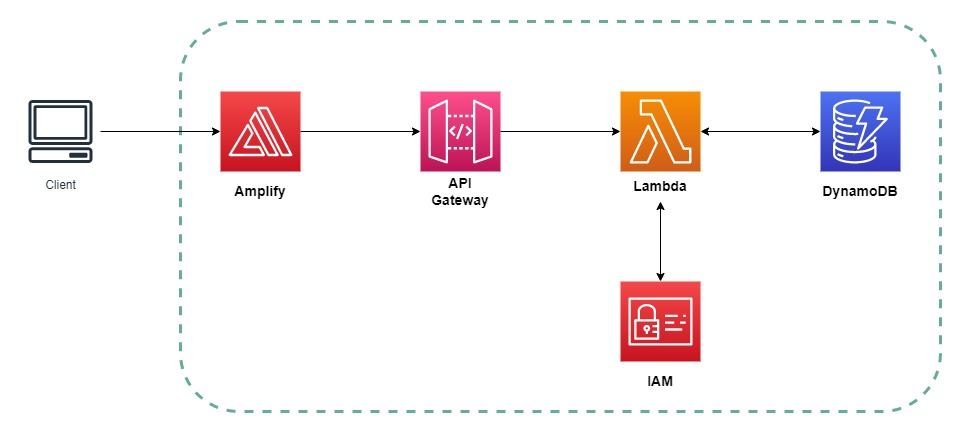
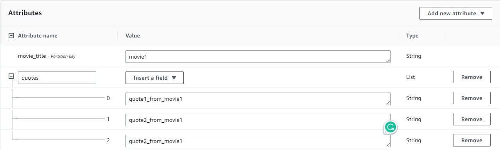
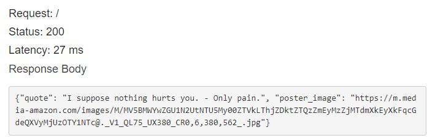

# schwarzenegger_quotes


## **Description**
This project was designed as a way to practice with the interaction between the following services: API Gateway, Lambda, DynamoDB, and Amplify.

The app randomly chooses a famous quote from one of many Arnold Schwarzenegger movies and shows it on the home page, with a picture of the related movie.
If the page is refreshed, a new quote will be shown.

## **Services Overview**

- **Amplify**
The front-end deployment is taken care by AWS Amplify. 
Amplify makes the deployment of new apps extremely easy. Thanks to an intuitive and simplified interface, is the ideal solution for building, shipping or hosting an app (web and mobile) quickly. In this case, Amplify is perfect because allows us to host the app very quickly: we just need to upload our files and we quickly get a URL that can be used to show our final product. 

- **API Gateway**
API gateway is responsible for accepting and processing requests coming from the client, making sure they are directed to the specific API resources.
This service is convenient for this particular use case because it offers CORS support, traffic management, throttling and monitoring. It also has no minimum fees or startup costs, making it ideal for running apps at the lowest costs possible. 

- **Lambda**
the backend layer starts with a Lambda, a service that allows us to provision just the computing power necessary to run our code. As long as our code doesn’t need to run for more than 15 minutes, Lambda functions are a great solution to provide fully managed computing at a very low price. Because our app doesn’t have specific requirements in terms of computing configurations and it’s not computing-demanding, Lambda is a perfect choice.

- **DynamoDB**
on the storage side of the application, the DynamoDB NoSQL database is ideal. 
DynamoDB is a fully managed service, with horizontal scaling capabilities and offers the choice between provision capacity or on-demand capacity.
On top of having great performance, it has full compatibility with other AWS services, making it very easy to implement inside an architecture.

All the services mentioned are great choices for serverless architectures, where you want to build something without having to worry about the underlying infrastructure of the services you are using. 

## **Step-By-Step Guide**
<p align="center">

</p>
1. **Create a table in DynamoDB**\
Select DynamoDB from the management console and click on the orange "create table" button.\
Name the table "arnold" (if you choose to name this table differently, please remember to change to the correspondent table's name on the Python script too)\
Use "movie_title" as partition key and create the table\
When created, click the "action" dropdown button and select "create item"\
You can now manually create each table's item (refer to the "quotes" document in this repository):\
First add the movie title as a value.\
Then click on "add new attribute", select "list" and add all the quotes relative to that specific movie.\
The following screenshot shows the structure of the item
<p align="center">
 
</p>
When all the quotes are added, the attribute "poster_image" can be created with the URL link as value.\
Before moving to the next step, under the "overview" tab of the table just created, copy the table's ARN and past it on a notepad for later use.\

2. **Create a Lambda function**\
Select Lambda from the Management Console and click on the orange "create function" button.\
Select "Author from scratch"\
Name your function\
Select "Python 3.9" as the runtime\
Leave the other settings as default and click "Create function"

In the "code" section of the page, delete the default script alredy written and swap it with the script from this repository (arnold.py)\

When triggered, this script simply run a query on a DynamoDB table named "arnold".\
Before querying the database, the script randomly pick a movie title from the list of movie titles, then use the result as a parameter for the query (to randomise the selection of the movie choice).\
From the response of the query, we get a list of quotes and the url for the movie's poster image.\
At this stage, we randomly choose a quote from the list of quote.\
We then return both the quote (as string) and the image URL (as string) inside the body of a json.dumps\
Please notice that the header returned is important for the correct interaction with API Gateway.\
Don't forget to click the "deploy" button to save the changes to the code.\

3. **Set IAM permissions**\
From the Lambda overview page, select the "Configuration" and on the left-hand side select "permission".\
Click on the Execution Role and the IAM page will be opened on a new tab.\
Click on "Add permission" and select "Create Inline Policy" from the drop down options
In the JSON section of the Create policy section, paste the following policy. Remember to paste the DynamoDB ARN where indicated.
```
{
    "Version": "2012-10-17",
    "Statement": [
        {
            "Sid": "VisualEditor0",
            "Effect": "Allow",
            "Action": [
                "dynamodb:PutItem",
                "dynamodb:DeleteItem",
                "dynamodb:GetItem",
                "dynamodb:Scan",
                "dynamodb:Query",
                "dynamodb:UpdateItem"
            ],
            "Resource": "PASTE_HERE_YOUR_TABLE_ARN"
        }
    ]
}
```
Click on "review policy", name it and then finally click on "create policy"\

4. **Create a REST API on API Gateway**\
Select now API Gateway from the console.\
Click on "Create API" and choose "REST API"\
Name it and click on "create API"\
Making sure you have "resources" selected on the left menu and the "/" selected at the top, open the "action" drop-down menu and select "create method".\
Open the new drop-down menu and sele the GET method. Click then the tick icon to confirm.\
In the -GET- Setup page that now appears, make sure you click on the "Use Lambda Proxy integration" options and select the lambda function created on step 2.\
Click save and ok on the next window appearing.\
From the "actions" drop down menu now, select "Enable CORS". Leave all the option as default and click on "enable CORS...", then click "yes".\

5. **TEST the API**\
Before continuing, we can test the API to make sure we are getting the correct response body from the Lambda function.\
From the -GET- Method execution page, click on the "test" button.\
Click on the blue "test" button and you should get a status 200, a response body made of aa quote and the image URL from the Database, as shown in the following screenshot.
<p align="center">

</p>
6. **Deploy the API**\
We can now deploy the API: from the "actions" menu select "Deploy API".\
Select "New Stage" and name the deployment stage (i.e. "dev" or "test"), then click to "deploy".\
Don't forget to copy the invocation URL that now appears at the top and save it on a notepad.\

7. **Deploy the front end on Amplify**
to complete
